# Azure VM Infrastructure Monitoring Automation - SOP

---

## Purpose

This Standard Operating Procedure (SOP) outlines the automated setup of a scalable, secure, and maintainable Azure VM monitoring infrastructure using industry best practices.  

---

## Features

- Infrastructure as Code: Use Terraform to provision VMs and outputs their details.
- Ansible playbook installs Docker & Docker Compose and other Tools and configures everything.
- Docker Compose manages all services on the collector VM.
- Easy-to-extend: Add more Node Exporter agents (just add to `group_vars/all_vars.yml`).
- Preloaded Grafana dashboards, datasources, and Prometheus alerts.

---

## Why This SOP?

- **For Clients:**  
  This SOP is designed to showcase not only my technical expertise but also my commitment to clear communication, repeatability, and world-class delivery. You’ll see that I deliver solutions you can trust, scale, and hand off to your team with confidence.

- **For Myself/Team:**  
  This document ensures that anyone—returning after years or onboarding for the first time—can quickly and accurately deploy, update, or extend this automation without guesswork. It minimizes operational risk and maximizes business continuity.

---

## What Sets This Solution Apart?

- **Enterprise-Ready Standards:**  
- **Clear Documentation:**  
- **Future-Proof:**  
- **Professional Delivery:**  

---

## Table of Contents

1. [Project Overview & Structure](#project-overview--structure)
2. [Control Node Setup](#control-node-setup)
3. [Terraform: Azure VM Provisioning](#terraform-azure-vm-provisioning)
4. [Ansible Automation](#ansible-automation)
5. [Best Practices & Troubleshooting](#best-practices--troubleshooting)
6. [Appendix: Screenshots & References](#appendix-screenshots--references)

---

## Project Overview & Structure

- **Main Directory:** `monitoring-automation`
- **Subfolders:**
  - `control-node/`: Control Node configuration and setup scripts
  - `terraform/`: Infrastructure as Code for Azure VMs
  - `ansible/`: Playbooks, inventory, and variables for automation

---


## VM Configuration Recommendation

Before you begin, make sure your control node VM meets the following minimum configuration.  
**You can use this as a reference to create your VM in Azure, AWS, or other cloud providers:**

| Setting             | Recommended Value               |
|---------------------|---------------------------------|
| **OS**              | Ubuntu 22.04 LTS (preferred)    |
| **vCPUs**           | 2 or more                       |
| **RAM**             | 4 GB or more                    |
| **Disk**            | 40 GB SSD or more               |
| **Network**         | Public IP, SSH (port 22) open   |
| **User**            | Non-root user with sudo         |
| **Region**          | Close to your location          |

- **Tip:** You can use a Standard B2s (Azure) / t3.small (AWS) or better.

---

## Prerequisites

- You have access to internet on the control node ( a Linux VM, e.g., Ubuntu).
- You can connect via SSH or already have a terminal open on the node.

---

## setup VS Code (on your laptop) to control project on VM (optional)

VS Code will connect and open a new window where you are now working **directly on the control node**. You can open folders, edit files, run terminals, and use all VS Code features as if you were local.

### **Step 1: Install Prerequisites**

- Install [VS Code](https://code.visualstudio.com/Download) on your laptop (Windows/macOS/Linux).
- Install the **Remote - SSH** extension from the VS Code Extensions marketplace.

### **Step 2: Set Up Your SSH Keys (if not already done)**

If you don’t already have an SSH key pair on your laptop, generate one:
```sh
ssh-keygen -t ed25519 -C "your_email@example.com"
```
Copy your public key to the control node:
```sh
ssh-copy-id <your-username>@<control-node-ip>
```

### **Step 3: Connect to the Control Node with VS Code**

1. Open VS Code.
2. Press `F1` (or `Ctrl+Shift+P`), and type `Remote-SSH: Connect to Host...`.
3. Enter:  
   ```
   <your-username>@<control-node-ip>
   ```
4. Select your saved SSH configuration or enter details when prompted.


---

## Troubleshooting

- If you see errors about unmet dependencies or package conflicts, follow the script prompts.
- For any login or permission issues, ensure your user has `sudo` privileges.
- For SSH connection issues, ensure port 22 is open and accessible, and your user is correctly configured on the control node.

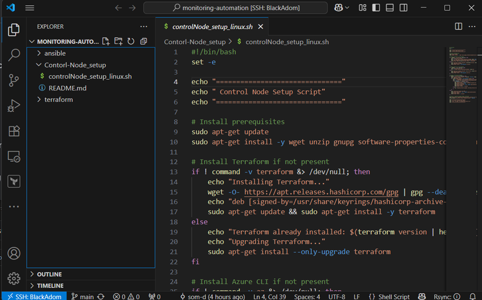

---
## Step-by-Step Control Node Setup Instructions


This guide describes how to set up the Control Node for the Azure VM Infrastructure Monitoring Automation project.

---

## Steps

1. **Clone the Repository on control node**
   ```sh
   git clone <your-repo-url>
   ```

2. **Navigate to the Project Directory**
   ```sh
   cd monitoring-automation
   ```

3. **Run the Control Node Setup Script**
   For Linux:
   ```sh
   ./Control-Node_setup/controlNode_setup_linux.sh
   ```

   > _Ensure the script has execution permissions. If not, run:_
   > ```sh
   > chmod +x ./Control-Node_setup/controlNode_setup_linux.sh
   > ```

- The script will check for and install or upgrade:
  - Terraform
  - Azure CLI
  - Ansible (with user prompts if conflicts)
  - Ansible Docker collection

**Follow any prompts** (especially for upgrading or reinstalling Ansible).
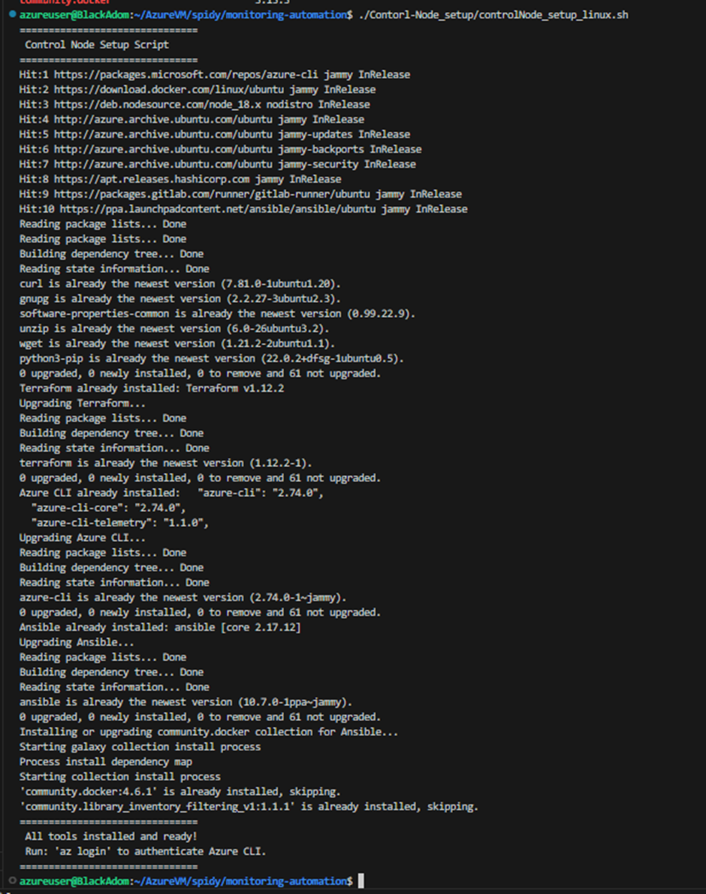

### 5. **Login to Azure**

After the script completes, run:
```sh
az login
```

- This will open a browser window or give you a code to enter at https://microsoft.com/devicelogin
- Login with your Azure credentials.

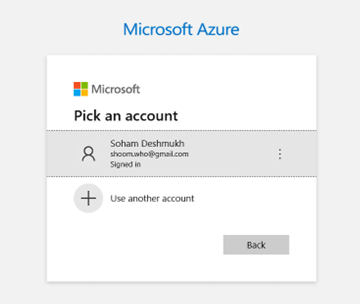
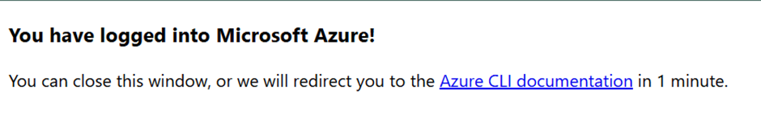

Come back to prompt press **Enter** for no change

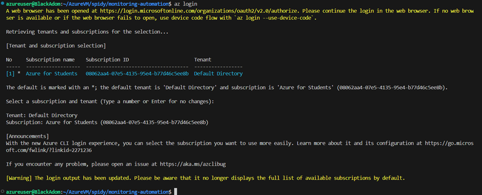

### 6. **Verify Installation (Optional)**

Check that each tool is ready by running:
```sh
terraform version
az --version
ansible --version
ansible-galaxy collection list | grep community.docker
```


---

## Terraform: Azure VM Provisioning

**Reference:** `terraform/README.md`

1. **Configure Variables:**  
   Set up `variables.tf` with Azure credentials, location etc.  
   update `vms.tf` file for adding more vms and configuring vms settings

   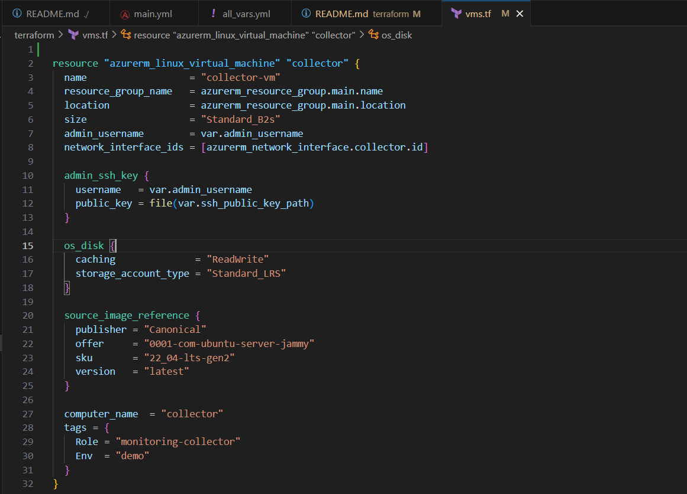

2. **Run Terraform:**  
   ```
   cd terraform
   terraform init
   terraform plan
   terraform apply
   ```
Type "yes" and Press **Enter**.

3. **VM Details:**  (**VIMP**)
   Save IPs and credentials for use with Ansible.

   Past the IP in ansible/group_vars/all_vars.yml
   
   Replace "=" with ":"


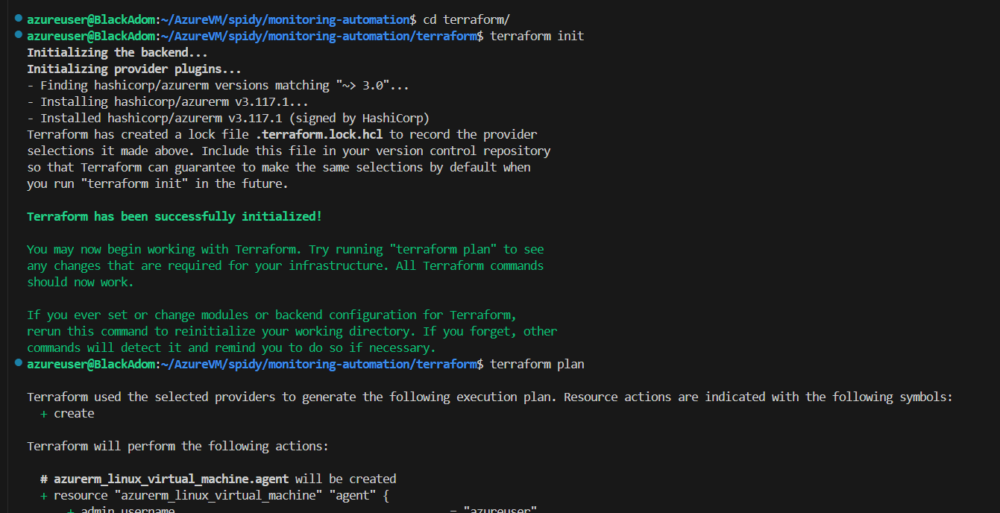
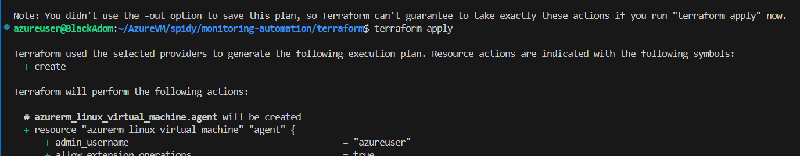

Type "yes" and Press **Enter**.

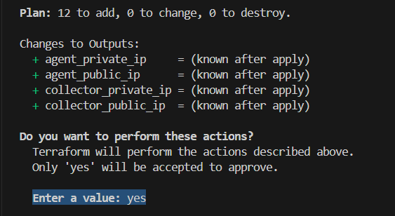

**Copy IP to use in ansible inventory**

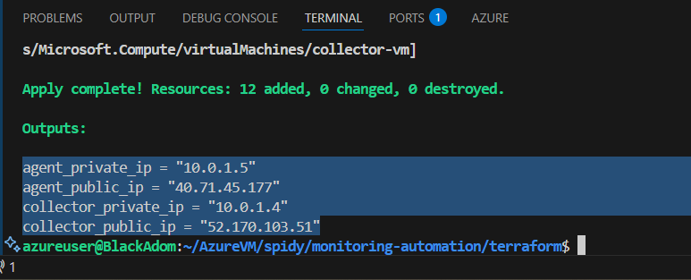

---

**Past the IP in ansible/group_vars/all_vars.yml**

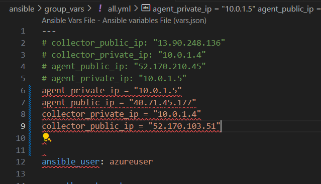

**Replace "=" with ":"**

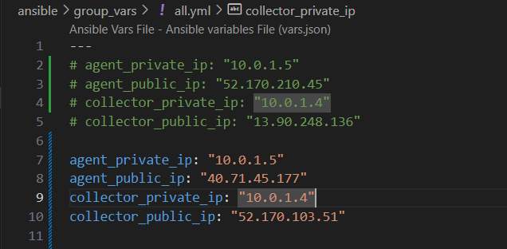

---

## Ansible Automation

**Reference:**  
- `ansible/README.md`  

---

## How to Customize

- **Add more agents:**  
  - Deploy Node Exporter on additional VMs.
  - Add their private IP and port to `prometheus_targets` in `group_vars/all_vars.yml`.

- **Change alert rules:**  
  - Edit `files/alert.rules.yml`.

- **Add/replace dashboards:**  
  - Place JSON files in `files/grafana/dashboards/`.

- **Change alert email:**  
  - Edit `alert_email` in `group_vars/all_vars.yml`.

---

## Security Notes

- Ensure SSH keys are used for Ansible access.
- Open only necessary ports in Azure NSG (22, 3000, 9090, 9093, 3001, 9100).

---

## Usage — Step by Step

1. **Update Ansible Variables**
   - Edit `group_vars/all_vars.yml` to reflect your VM IPs and alert email.


2. **Update Inventory**
   - Edit `inventory.ini` with the public IPs of your VMs.

3. **Run the Playbook**
   ```sh
   cd ..
   cd ansible
   ansible-playbook -i inventory.ini main.yml
   ```
   Type **yes** press **Enter** again type **yes** press **Enter**

   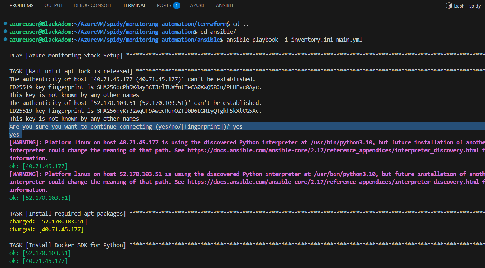

4. **Access Services**
   - Grafana: `http://<collector_public_ip>:3000`   userid: admin  passwd: admin (default) then navigate to Home > Dashboards > Node Exporter Full (dashboardName)
   - Prometheus: `http://<collector_public_ip>:9090`
   - Alertmanager: `http://<collector_public_ip>:9093`
   - Uptime Kuma: `http://<collector_public_ip>:3001`

---

## Appendix: Screenshots & References

- **Grafana Login**

   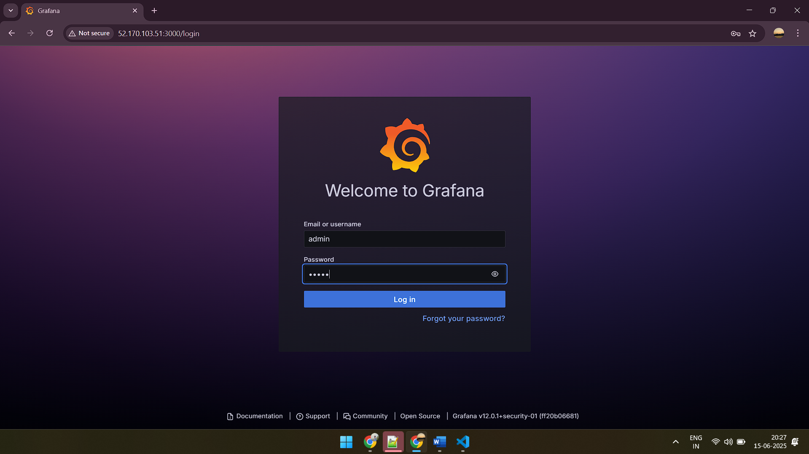

   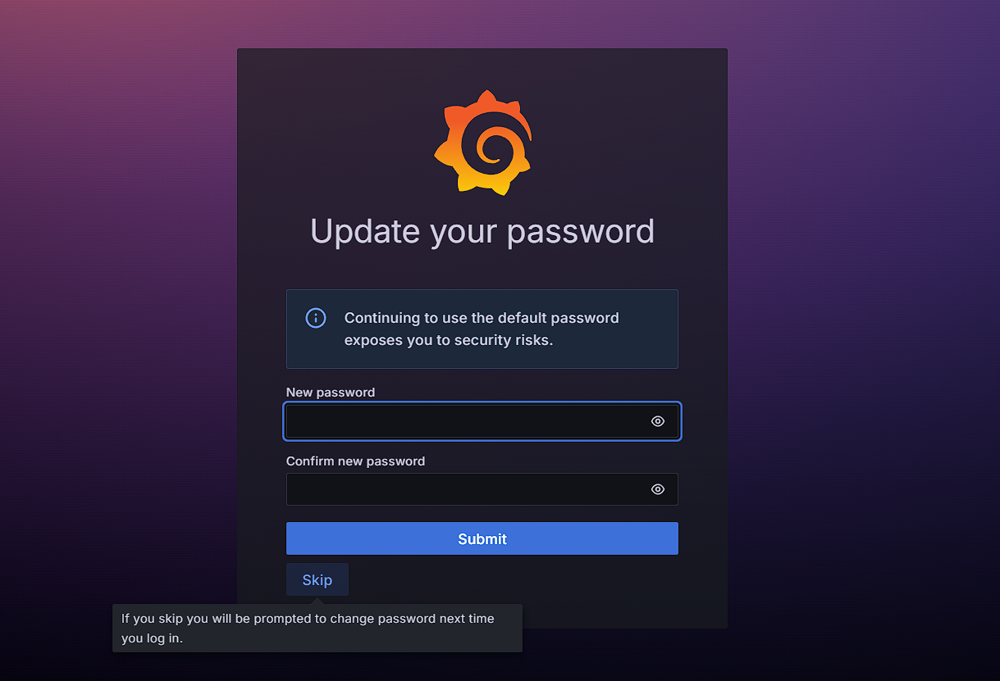

- **Grafana Dashboard**

   navigate to Home > Dashboards > Node Exporter Full (dashboardName) 
   Click on **Node Exporter Full**

   

   

- **Prometheus Dashboard**
   Navigate to Status > Target health

   

   

   **In Alerts**

   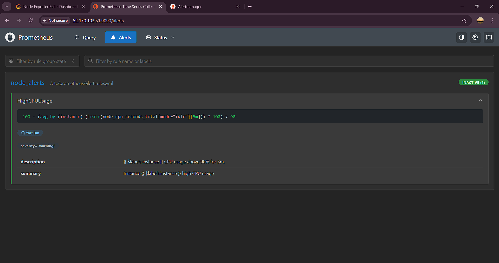

- **Alertmanager**

   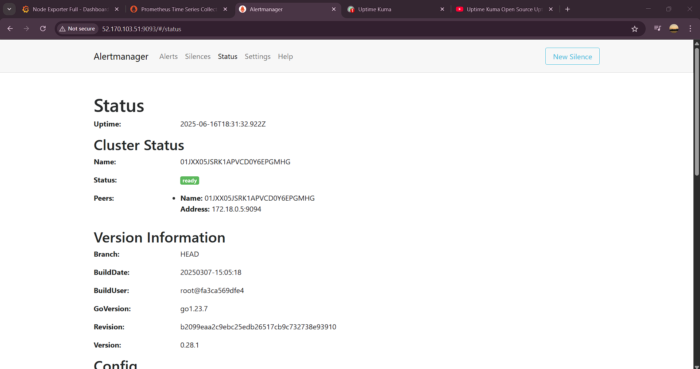

- **Uptime Kuma**

   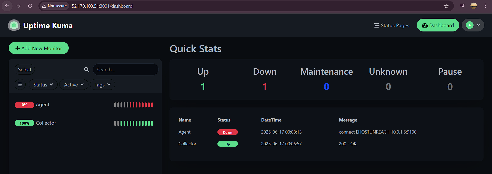
---
## Best Practices & Troubleshooting

- **Security:**  
  SSH keys preferred; secrets never hard-coded.
- **Idempotency:**  
  All scripts/playbooks are safe to run multiple times.
- **Error Handling:**  
  Common issues (auth, connectivity, variable misconfiguration) and solutions included.
- **Extensibility:**  
  Easy to add new nodes, collectors, or monitoring tools.

---

**clean UP**
   To remove all resources created by Terraform:
   ```sh
   terraform destroy
   ```

   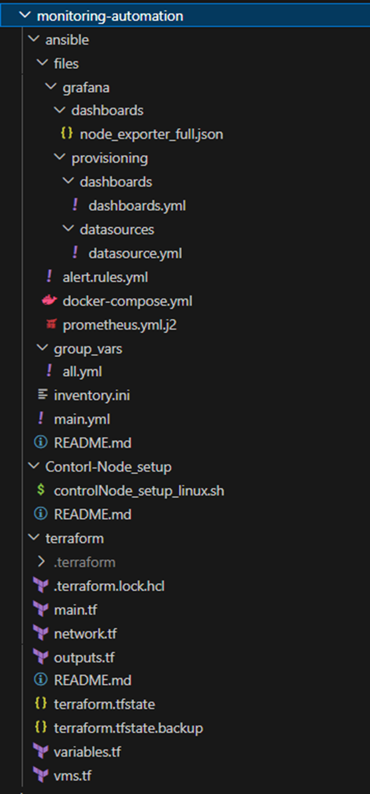

   Type **yes** and Press **Enter**

   

   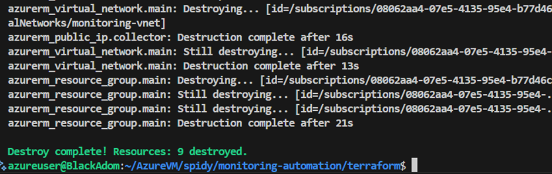
---
**Questions?**  
Open an issue in this repo or contact [soham](mailto:sohamdeshmukh611@gmail.com) (project owner).